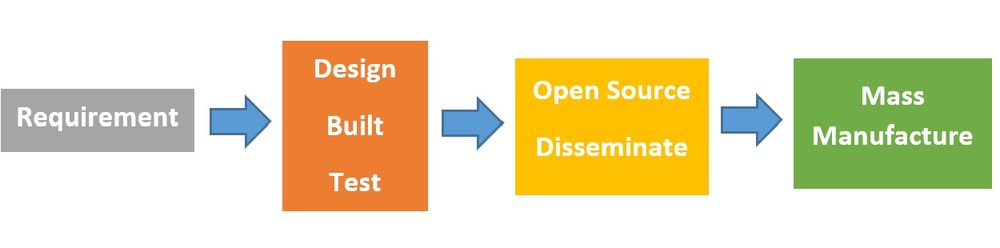

### Background  
The Covid-19 novel coronavirus epidemic has taken the world by storm. From humble beginnings in Wuhan, China at the end of 2019, it has gone on to infect more than a million people with a case fatality rate of more than 5%. Complications may include pneumonia and acute respiratory distress syndrome (ARDS). There is no known vaccine or specific antiviral drug treatment. It is estimated that 30% of Covid-19 hospitalized patients are likely to require mechanical ventilation [1].  However, there is a huge gap which appears to be widening every day between supply and demand of ventilators, so much so that doctors are forced to make life and death decisions due to shortage thereof [2]. The price of ventilators has jumped by 150% due to unbridled free market mechanics [3]. This has driven engineers across to world to find cheap, affordable and quick solutions to expensive branded ventilators where traditional manufacturers are struggling to meet demand. Many, but not all, of these efforts are open sourced by the inventors, meaning that they can be manufactured and improved upon without the fuss and commercial greed associated with patents and licenses in this hour of need for humanity.   
### The Initiative 
With the advent of this pandemic in Pakistan, a small group of engineers started preparing the technological response of this nation with limited resources on volunteer basis. What started off as disparate and isolated efforts soon gathered steam and snowballed into Pakistan Against Corona – Volunteers (PAC-V), a coalition of volunteers searching for engineering solutions in the fight against corona virus. The central ethos is as follows:  
  
The (PAC-V) headed by Dr. Bilal Siddiqui, former chief engineer at PAC Kamra compiled a team specifically to work towards developing mechanical ventilators in Islamabad. A parallel effort was also started by Muhammad Umair Arif from Bahria University and Dr. Abid Kareem from Usman Institute of technology in Karachi in developing “Low cost ventilators”. The two groups rapidly grew with more than a 500 people from various background and eventually merged their efforts into a single initiative called OpenVentPk.  
In the span of a few days, starting on 15th of March 2020, literally hundreds of engineers, medics, programmers and manufacturers combined forces in the open-source spirit to serve the suffering humanity. The authors claim neither credit nor ownership and freely transfer all rights to replicate, improve, make and provide to the world. We are compatriots of humanity and believe in the fundamental right to life and happiness without recourse to profiteering.
OpenVentPk is archived at GitLab and GitHub. When we started, we were perhaps the only team working on ventilators in the country. In a meeting called by the engineering council (PEC) on the 24th of March, there were six teams (including two existing products patented in the USPTO). In another week, the initiative we took had mushroomed to 50 teams nationwide. While we wholeheartedly welcome this outpouring of engineering vigor, we are happy to be precursors of this rapid development, and readily incorporate all open-source projects on ventilators in the country that have joined forces with us.  
OpenVentPk is the only open source ventilator project in Pakistan which has a serious team of engineers, medical practitioners, 3D printing companies. Large scale manufacturing teams are also onboard for industrial scaling later.  
### The team  
We have a very committed team of professional and extremely competent people from all over the country and beyond to serve for this cause. During this lockdown situation, this team has been solving problems as they come in a very coordinated manner for the fulfillment of the objective.
The Overall team is lead by Muhammad Umair, Asst. Prof at Bahria University, a PhD scholar at NUST and co-founder of The Disrupt Labs. The R&D is being coordinated and facilitated by Dr. Bilal Siddiqui, former chief engineer at Pakistan Aeronautical Complex Kamra, The 3-D printing team is being lead by Mr. Tayyab from Xplorer 3D with Abdullah, Farrukh and shaheer. Another team lead by Mr. Rabi from Grit3D with Azeem and Asad. The mechanical assembly of compression mechanism is being lead by Mr. Jamal from Aceforge. The mathematical modeling team is lead by Sarim from University of waterloo along with Noman .  The Embedded software team is being lead by Mr. Sohaib Ashraf along with Dr. Sharif, Sir Wajid and Usman. The embedded hardware team is being lead by Mr. Hamza Azeem from Signaxes and the team includes Hashir azeem, Rahil jabbar ,Aitezaz, Kamran, Munum and Faraz. The problem of finding sensors was being handled by Zeeshan Abbasi from mparsec and Asher. The Mechanical calibrations team is being Lead by Mr. Hassan from PPL, Ghufran from Shell Pakistan, Farooq from Pakistan Oxygen company and shahjahan. The UI team is being lead by Danish, former R&D Manager at Wavetech along with Anas and Data science expert abdul Wahid. Technical advice and input being given by Azeem Anwar and Dr. Abid kareem. The Medical Input team is being lead by Dr. Ali Shoaib from Liaqat National Hospital, Dr. Mehreen and Dr. Akbar from Agha khan hospital. The local testing and compliance is being lead by Nadeem From Fast University along with Ateeq & Rafique. The detailed documentation is being done by Shamoon and Atif. The procurement was facilitated by Danish from Suparco. The industrial onboarding and mass scaling process is being lead by Osama Ehtisham. The current prototype is being built at The Disrupt Labs in Karachi funded by Saima Rizvi. The logo was facilitated by Mudassir from Jafrix, the domain & hosting was purchased by Yasir and website is being built by Adeel from Bizintel, Arsalan and Fahad from Pluton. Hira wajahat from Stimulus is looking at international communications.   
### RoadMap
OpenVentPk team plans to develop the minimally clinically acceptable ventilator to be used in hospitals to confer therapeutic benefit on a patient suffering with ARDS, used in the initial care of patients requiring urgent ventilation. It is proposed these ventilators would be for short-term stabilization for a few hours, but this may be extended up to 1-day use for a patient in extremis as the bare minimum function. Ideally it would also be able to function as a broader function ventilator which could support a patient through a number of days, when more advanced ventilator support becomes necessary.  
Pakistan Engineering Council has identified the bare minimum requirements to be according to the requirements set by Department of Health and Social Care (DHSC) of the UK government. The guidelines published on 20th March, 2020 are entitled as “Rapidly manufactured ventilation system specifications” [4]. Our core focus is to meet the “Mandatory requirements” set by these guidelines within 4 weeks starting from 23rd March, 2020 onwards.   
### Design Philosophy
We have defined our overall design philosophy according to the emergency situation ahead. The following are our key components.  
- Open source for use worldwide and contributions from others worldwide.
- Adult ventilator (older adults are at higher risk).  
- Positive pressure volume control ventilation for intubated patients. 
- A bare bones, safe design.
- The design(s) will be validated; validation will be documented and transparent
- The design(s) will be modular allowing different modules to be mixed and matched depending on local availability 
- Unboxed design – all parts directly accessible
- Design will be inexpensive to build (parts for base model less than $300 US).
- Assembled quickly with readily accessible parts
- Dissemination via Internet (Google docs, Github, website-   
We are also relying upon the following assumptions:   
- FDA will waive clearance for the bare bones design if there is a massive shortage 
- Traditional medical components and supplies used in ventilators will be in short supply 
- Transportation will be impaired/disrupted.  Locally available non-medical supplies and equipment readily available at local hardware stores such as sprinkler valves and PVC tubing will be used.   
### Technical Specification of OpenVentpk Design 1 (OVPD-1)
The following Table has been vetted against the requirements put forward in the second edition (11/04/2020) of Pakistan Engineering Council (PEC) document titled *Fast Track Acceptance Test Procedure for Locally Manufactured Mechanical Ventilators for ICU*  
1.	Modes of Ventilation:  
    1.1.1.	 Controlled Modes  
        1.	PCV  
        2.	VCV  
    1.1.2.	 Assist Modes:  
        1.	AC-PC  
        2.	AC-VC  
2.	Set Parameters   
    i)	PEEP (5cm of H2O upto 20cm of H20)  
    ii)	FiO2 (50-60% and 90-100%)  
    iii)	Tidal Volume (200-700)  
    iv)	I:E Ratio (1:1 to 1:3)  
    v)	Triggering (flow triggering -0.5 to 5 litres per minute)  
    vi)	Respiratory rate(8-35 per minute)]  
    vii)	Pressure Control (0-40 cm H2O)  
3.	Measured Parameters  
    i)	Expired Tidal Volume  
    ii)	Respiratory Rate (Based on input from O2,flow & pressure sensors)  
    iii)	Plateau Pressure (Every breath)  
    iv)	Peak Airway Pressure   
    v)	FiO2   
4.	Cycling  
    i)	Flow  
    ii)	Pressure  
    iii)	Volume  
5.	Alarms:  
    i)	Battery backup  
    ii)	Circuit Integrity (Hardware watchdog)  
    iii)	High  and Low Breath Rate  
    iv)	Peak Inspiratory Pressure   
    v)	High FiO2  
    vi)	Oxygen Failure (Pressure switch to be used)    
    vii)	Tidal Volume  
    viii)	Minute Volume  
    ix)	Disconnection (patient not present)  
    x)	96 hours of operation  
6.	Non Invasive Ventilation(NIV): Optional and preferable   
7.	Electrical Connections: Equipment to provide standard electrical connections  
8.	Peak Inspiratory Flow Rate-   
    Ventilator should be able to manage peak inspiratory flow rates up to 100lpm  
9.	Safety Valve:  (Manual valve) to avoid sudden unexpected increase in pressure. 
10.	Self-test: Automatic test(s): Performed by the device upon itself when switched on, to detect any malfunction, a missing component, or a change in its configuration with a test lung

### Documents Required for Ventilator Approvals  
The following documents are meant to provide a checklist of the requirements put forward in the second edition (11/04/2020) of Pakistan Engineering Council (PEC) document titled Fast Track Acceptance Test Procedure for Locally Manufactured Mechanical Ventilators for ICU.  
#### OpenVentPk Specifications  
This document should include the following things:  
1.	General Information about type of ventilation
    1.	Invasive and non-invasive
    2.	For adults.
    3.	Clinical Environments :- Hospitals, institutions, transport, Home Care
    4.	Alarm volume: Range in decibels
    5.	Battery Power: Timings for continuous use
    6.	Power Sources: AC (wall plugin) DC external batteries
    7.	Battery backup ( at least 1 hour up to 3 hours): Timings 
    8.	External Power Requirements: AC power, dc power
    9.	Physical Dimensions  : Weight, height, depth
    10.	User Interface: Display Size, Types of Buttons
    11.	Operating Environments: Temperature, humidity, Pressure
    12.	Electromagnetic Compatibility and Protection: Standards Implemented
    13.	Electro Static Discharge (ESD) levels.
2.	Controls:
    1. Breath Rate  
    2. PEEP
	3. FiO2
	4. Flow Cycle
	5. IPAP
	6. Tidal Volume
	7. Time Cycle
	8. Modes of ventilation:
        1. Pressure Controlled Ventilation (PCV)
	    2. Volume Controlled Ventilation (VCV)
	    3. Assist Control-Pressure Control(AC-PC)
      	4. Assist Control- Volume Control (AC-PC)
3.	Alarms:
    1. Battery 
    2. Circuit Integrity
    3. High breath rate
    4. High FiO2
    5. High PEEP
    6. Low Breath Rate
    7. Low FiO2
    8. Low Inspiratory Pressure
    9. Low Peep
    10. Oxygen Failure
    11. Tidal Volume
    12. Minute Volume
    13. Patient Disconnection
4.	Components 
    1. Bill of material
    2. Component specifications
### OpenVentPk Manual  
The ventilator manual at minimum must contain the following information in an easy to understand language:
1.	General Information
2.	Device Description
3.	Technical specifications
4.	Equipment Symbols
5.	Safety Information
6.	Installation
7.	Operation
8.	Revision History (if Any)
9.	Disassembly and Assembly
10.	Software Download Procedure
11.	Calibration Procedure
12.	Operational Verification Procedure
13.	Troubleshooting
14.	Maintenance and Cleaning
15.	Appendix (schematics, control diagrams, codes)  
### OpenVentPk Compliance & Test Report
This report is a major report for software, hardware, functional and clinical testing of the ventilator:  
1.	Introduction
2.	Technical Specifications
3.	Compliance and Testing procedure
4.	Calibration Testing of Ventilator
5.	Software testing of Ventilator 
6.	Hardware Testing of Ventilator 
7.	Functional Testing of Ventilator
8.	Clinical Testing of Ventilator  
### Current Progress:
Most of the designs in opensource are based on mechanical compression of bag valve mechanism (BVM) also known as ambubag, based on a seminal project at MIT [5]. We would like to acknowledge learning from all opensource projects in the world, including MIT e-vent. This design iteration basically revolves around OpenVentPk has divided the project into several milestones. We have been following a rigorous design process and a standard way of developing such a complicated device. The progress of the milestones are as under:  

| **S.No.** | **Milestone**                                        | **Status**                |
|-------|--------------------------------------------------|-----------------------|
|       | **Design Phase**                                     |                       |
| 1     | Understanding the ventilator operation in detail | √                     |
| 2     | Taking input from the doctors                    | √                     |
| 3     | Finalizing the functional requirements           | √                     |
| 4     | Developing a system level diagram                | √                     |
| 5     | Selection of compression mechanisms              | √                     |
| 6     | Development of a pseudo code                     | √                     |
| 7     | Development of Electrical flow                   | √                     |
| 8     | Finalizing of sensors                            | √                     |
| 9     | Development of a Compliance and QA document      | √                     |
| 10    | UI design input from Doctors and developers      | √                     |
|       |                                                  |                       |
|       | **Implementation Phase**                             |                       |
| 11    | Procurement of required items                    | √                     |
| 12    | 3D printing of compression mechanisms            | √                     |
| 13    | Cutting of other mechanisms                      | √                     |
| 14    | Implementation of electrical circuit             | In process            |
| 15    | Implementation of Final code                     | In process            |
| 16    | Implementation of sensors                        | In process            |
| 17    | Implementation of UI on Tablet & Server          | In process            |
| 18    | Assembling of the prototype                      | In process            |
| 19    | Calibration of all equipment                     | In process            |
|       |                                                  |                       |
|       | **Documentation Phase**                              |                       |
| 1     | OpenVentPk manual                                | In process            |
| 2     | OpenVentPk Specifications                        | In process            |
| 3     | OpenVentPk Compliance & Test reports             | In process            |
|       |                                                  |                       |
|       | **Clinical Trials and Testing**                      | **Not Started**           |
|       | **Approvals from PEC, DRAP etc**                    | **Not Started**           |
|       | **Clinical trials in Hospitals**                     | **Approvals being taken** |
|       | **Onboarding of large scale manufacturing Setups**   | **In process**            |
|       | **Mass scale manufacturing**                         | **Not started**           |

